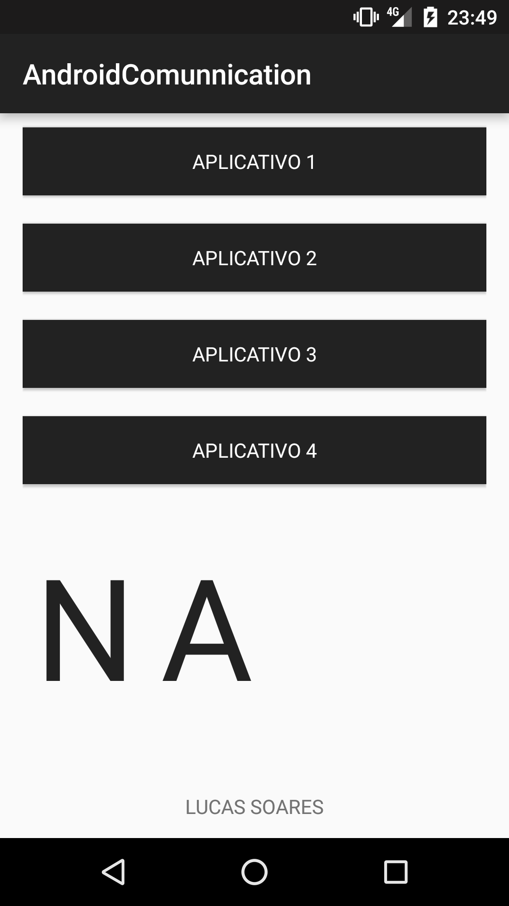
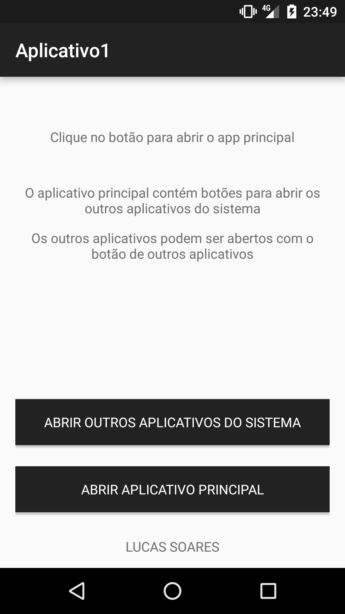

# AppsCommunication
Projeto de um sistema de comunicação entre aplicativos, via intent.

<h2>Aplicativos </h2>

  - <b>Aplicativo principal</b> -  recebe informações dos demais apps, e forma uma palavra com estas informações. Também consegue abrir todos os outros apps.
  
  
  
  - <b>Aplicativo 1 </b> - manda a primeira letra da palavra para ser formada no app principal.
  
  
  
